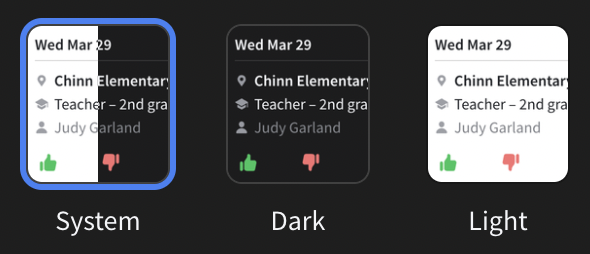

<div class="markdown-body">

# @aparajita/tailwind-ionic&nbsp;&nbsp;[](https://badge.fury.io/js/@aparajita%2Ftailwind-ionic)

This plugin for [Tailwind CSS](https://tailwindcss.com/) and [Ionic](https://ionic-framework.com) provides several features:

- Variants which help you to target specific platforms and modes in an Ionic application.
- A `part` variant to target CSS parts in an Ionic component (or any other component that uses CSS parts).
- Ionic CSS theme variables are converted into Tailwind colors.
- An `ion-checked` variant to target the checked state of an Ionic checkbox or radio button. 

## Breaking changes from v1.x
- The non-abbreviated variants (prefixed with "ion-") in v1.x have been removed.
- The `ios` and `md` variants have been renamed to `mode-ios` and `mode-md`, and only apply to the `mode` attribute of the `html` element.

## Installation

```shell
pnpm add @aparajita/tailwind-ionic
```

If you only want the default variants and no Ionic theme colors, add the plugin to your `tailwind.config.js` file:

```javascript
module.exports = {
  plugins: [require('@aparajita/tailwind-ionic')]
}
```

If you want to configure the behavior, read on.

## Usage

### Platform/mode variants

The platform/mode variants in the table below are supported. Variants lower in the list are more specific and are applied after variants higher in the list. This means that a less specific variant applied to a given class will be overridden by a more specific variant applied to the same class.

Note that you cannot combine variants directly, but you can combine the effect of separate variants.

| Variant       | Target                                             |
|:--------------|:---------------------------------------------------|
| plt-desktop   | Desktop mode                                       |
| plt-mobile    | Mobile-like device (including browser simulations) |
| plt-mobileweb | Mobile device simulation mode in a browser         |
| plt-native    | Real device using Capacitor                        |
| plt-ios       | iOS device (including browser simulations)         |
| plt-android   | Android device (including browser simulations)     |
| mode-ios      | App is in iOS style mode                           |
| mode-md       | App is in Material Design style mode               |

#### Examples (with abbreviated variant names)

```html
<!-- BAD. Can't combine these variants with others directly. -->
<ion-label class="plt-native:plt-ios:text-ion-color-primary" />

<!-- 
  GOOD. Separate variants combine.
  On a real iOS device, bold blue color. 
  On a real Android device, bold yellow color. 
-->
<ion-label
  class="
  plt-native:font-bold
  plt-ios:text-blue-500
  plt-android:text-yellow-500
"
/>

<!-- GOOD. More specific variant overrides. On a real iOS device, red color. -->
<ion-label class="plt-native:text-blue-500 plt-ios:text-red-500" />
```

### Part variants

The `part-` variant allows you to target CSS parts in an Ionic component (or any other component that uses CSS parts). All of the currently defined component parts are provided as auto-complete suggestions in your editor. Part variants can be combined with other variants.

#### Examples

```html
<!-- Make a button fully rounded -->
<ion-button class="part-native:rounded-full" />

<!-- Equivalent to: -->
<ion-button class="my-button" />

<style>
  .my-button::part(native) {
    @apply rounded-full;
  }
</style>
```

### Checked variant

The `ion-checked` variant allows you to target the checked state of an `ion-checkbox` or `ion-radio`. It can be combined with other variants, in particular the `part-` variant, to accomplish complex styling of `ion-checkbox` and `ion-radio` components entirely with Tailwind.

#### Examples

Here is a radio group using images for the radio buttons. The checked state is indicated by a blue ring.



Here is the markup:

```html
<ion-radio-group
  v-model="appearance"
  class="flex w-full justify-around pt-5 pb-3"
>
  <div
    v-for="info in kAppearanceInfo"
    :key="info.label"
    class="relative flex flex-col items-center"
  >
    <ion-radio
      :value="info.value"
      class="m-0 h-[80px] w-[72px] rounded-lg part-container:border-none part-mark:hidden ion-checked:ring ion-checked:ring-blue-500"
    />
    
    <p class="mt-2 text-sm text-ion-color-dark">
      {{ info.label }}
    </p>
  </div>
</ion-radio-group>
```

Or, for example, if you want a checkbox to be `yellow-500` in the unchecked state and `indigo-500` with an `indigo-400` border in the checked state, you would do this:

```html
<ion-checkbox
  class="
    part-container:!bg-yellow-500 
    ion-checked:part-container:!bg-indigo-500 
    ion-checked:part-container:!border-indigo-400
  "
/>
```

Note that `part-container` is used to target the checkbox markup itself and `!` is necessary to override the Ionic styles.

### Theme colors

If you pass the plugin one or more valid paths to a CSS file containing Ionic theme variables, they are converted into Tailwind theme colors.

```javascript
/** @type {import('tailwindcss/types').Config} */
/** @type {import('@aparajita/tailwind-ionic').plugin} */

const ionic = require('@aparajita/tailwind-ionic')

module.exports = {
  plugins: [ionic('src/theme/variables.css')]
}
```

You may also pass the path as a `.theme` property of an options object, or an array of strings or objects with a `.theme` property. This allows you to access the Ionic theme files along with your own customizations.

```javascript
/** @type {import('tailwindcss/types').Config} */
/** @type {import('@aparajita/tailwind-ionic').plugin} */

const ionic = require('@aparajita/tailwind-ionic')

module.exports = {
  plugins: [ionic({
    theme: 'src/theme/variables.css',
  })]
}
```

```javascript
/** @type {import('tailwindcss/types').Config} */
/** @type {import('@aparajita/tailwind-ionic').plugin} */

const ionic = require('@aparajita/tailwind-ionic')

module.exports = {
  plugins: [ionic([
    'src/theme/variables.css',
    'assets/css/theme.css',
    require.resolve('@ionic/vue/css/palettes/dark.class.css'),
  )]
}
```

#### Example

If the file `variables.css` is this:

```css
/** Ionic CSS Variables **/
:root {
  /** primary **/
  --ion-color-primary: #3880ff;
  --ion-color-primary-rgb: 56, 128, 255;
  --ion-color-primary-contrast: #ffffff;
  --ion-color-primary-contrast-rgb: 255, 255, 255;
  --ion-color-primary-shade: #3171e0;
  --ion-color-primary-tint: #4c8dff;

  /* ...lots more */
}
```

then your effective Tailwind config ends up being this:

```js
module.exports = {
  theme: {
    extend: {
      colors: {
        // ...whatever colors you have in your tailwind.config.js
        
        'ion-color-primary': 'var(--ion-color-primary)',
        'ion-color-primary-rgb': 'var(--ion-color-primary-rgb)',
        'ion-color-primary-contrast': 'var(--ion-color-primary-contrast)',
        'ion-color-primary-contrast-rgb': 'var(--ion-color-primary-contrast-rgb)',
        'ion-color-primary-shade': 'var(--ion-color-primary-shade)',
        'ion-color-primary-tint': 'var(--ion-color-primary-tint)',
        // ...and so on
      }
    }
  }
}
```

Because the variables are part of the color palette, they are added into all of the Tailwind color utilities: text, bg, border, etc.

```html
<ion-label class="text-ion-color-primary">My label</ion-label>
<span class="text-ion-color-success">Success!</span>
<div class="bg-ion-color-background">
  <!-- content -->
</div>
<div class="border-ion-color-tertiary-tint">
  <!-- content -->
</div>
```

</div>
